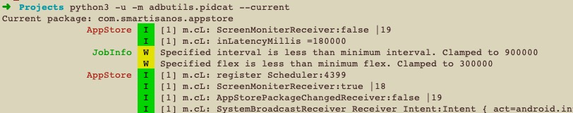

# adbutils
[](https://pypi.org/project/adbutils/#history)
[](https://codecov.io/gh/openatx/adbutils)

Python adb library for adb service

# Requires
Python 3.8+

**Table of Contents**

<!--ts-->
   * [adbutils](#adbutils)
   * [Install](#install)
   * [Usage](#usage)
      * [Connect ADB Server](#connect-adb-server)
      * [List all the devices and get device object](#list-all-the-devices-and-get-device-object)
      * [Connect remote device](#connect-remote-device)
      * [adb forward and adb reverse](#adb-forward-and-adb-reverse)
      * [Create socket connection to the device](#create-socket-connection-to-the-device)
      * [Run shell command](#run-shell-command)
      * [Transfer files](#transfer-files)
      * [Extended Functions](#extended-functions)
      * [Run in command line 命令行使用](#run-in-command-line-命令行使用)
         * [Environment variables](#environment-variables)
         * [Color Logcat](#color-logcat)
      * [Experiment](#experiment)
      * [Examples](#examples)
   * [Develop](#develop)
      * [Watch adb socket data](#watch-adb-socket-data)
   * [Thanks](#thanks)
   * [Ref](#ref)
   * [LICENSE](#license)

<!-- Added by: shengxiang, at: 2021年 3月26日 星期五 15时05分04秒 CST -->

<!--te-->

# Install
```
pip3 install adbutils

# or
pip3 install adbutils[all]
```

# Usage
Example

## Connect ADB Server
```python
import adbutils

adb = adbutils.AdbClient(host="127.0.0.1", port=5037)
for info in adb.list(extended=True):
    print(info.serial, info.state)
    # <serial> <device|offline>
    print(info.transport_id)

# only list state=device
print(adb.device_list())

# Set socket timeout to 10 (default None)
adb = adbutils.AdbClient(host="127.0.0.1", port=5037, socket_timeout=10)
print(adb.device_list())
```

The above code can be short to `from adbutils import adb`

## List all the devices and get device object
```python
from adbutils import adb

for d in adb.device_list():
    print(d.serial) # print device serial

d = adb.device(serial="33ff22xx")

# or
d = adb.device(transport_id=24) # transport_id can be found in: adb devices -l

# You do not need to offer serial if only one device connected
# RuntimeError will be raised if multi device connected
d = adb.device()
```

The following code will not write `from adbutils import adb` for short

## Connect or disconnect remote device
Same as command `adb connect`

```python
output = adb.connect("127.0.0.1:5555")
print(output)
# output: already connected to 127.0.0.1:5555

# connect with timeout
try:
    adb.connect("127.0.0.1:5555", timeout=3.0)
except AdbTimeout as e:
    print(e)

adb.disconnect("127.0.0.1:5555")
adb.disconnect("127.0.0.1:5555", raise_error=True) # if device is not present, AdbError will raise

# wait-for-device
adb.wait_for("127.0.0.1:5555", state="device") # wait for device online, state default value is "device"
adb.wait_for("127.0.0.1:5555", state="disconnect") # wait device disconnect
```

## adb forward and adb reverse
Same as `adb forward --list` and `adb reverse --list`

```python
# list all forwards
for item in adb.forward_list():
    print(item.serial, item.local, item.remote)
    # 8d1f93be tcp:10603 tcp:7912
    # 12345678 tcp:10664 tcp:7912

# list only one device forwards
for item in adb.forward_list("8d1f93be"):
    print(item.serial, item.local, item.remote)
    # 8d1f93be tcp:10603 tcp:7912
    # 12345678 tcp:10664 tcp:7912


for item in adb.reverse_list():
    print(item.serial, item.local, item.remote)

# 监控设备连接 track-devices
for event in adb.track_devices():
    print(event.present, event.serial, event.status)

## When plugin two device, output
# True WWUDU16C22003963 device
# True bf755cab device
# False bf755cab absent

# When adb-server killed, AdbError will be raised
```

## Create socket connection to the device

For example

```python
# minitouch: https://github.com/openstf/minitouch
c = d.create_connection("unix", "minitouch")
print(c.recv(500))
c.close()
```

```python
c = d.create_connection("tcp", 7912) # the second argument must be int
c.send(b"GET / HTTP/1.1\r\nHost: localhost\r\n\r\n")
print(c.recv(500))
c.close()
```

```python
# read device file
with d.create_connection(adbutils.Network.DEV, "/data/local/tmp/hello.txt") as c:
    print(c.recv(500))
```

There are many other usage, see [SERVICES.TXT](https://cs.android.com/android/platform/superproject/+/master:packages/modules/adb/SERVICES.TXT;l=175) for more details

Thanks for Pull Request from [@hfutxqd](https://github.com/openatx/adbutils/pull/27)

## Run shell command
I assume there is only one device connected.

```python
import io
from adbutils import adb

d = adb.device()

print(d.serial) # 获取序列号

# Argument support list, str
serial = d.shell(["getprop", "ro.serial"]) # 获取Prop信息

# Same as
serial = d.shell("getprop ro.serial")

# Set timeout for shell command
d.shell("sleep 1", timeout=0.5) # Should raise adbutils.AdbTimeout

# Open shell as connection
c = d.open_shell('cat') # AdbConnection, use c.conn to get socket.socket object
c.send(b'hello\n')
print(c.recv(100))
c.close()
# Expect output: b'hello\n'

# The advanced shell (returncode archieved by add command suffix: ;echo EXIT:$?)
ret = d.shell2("echo 1")
print(ret)
# expect: ShellReturn(args='echo 1', returncode=0, output='1\n')

# Advanced shell using the shell v2 protocol
ret = d.shell2("echo 1; echo 2 1>&2", v2=True)
print(ret)
# expect: ShellReturn(command='echo 1; echo 2 1>&2', returncode=0, output='1\n2\n', stderr='2\n', stdout='1\n')

# show property, also based on d.shell
print(d.prop.name) # output example: surabaya
d.prop.model
d.prop.device
d.prop.get("ro.product.model")
d.prop.get("ro.product.model", cache=True) # a little faster, use cache data first

d.get_serialno() # same as adb get-serialno
d.get_devpath() # same as adb get-devpath
d.get_state() # same as adb get-state
```

Take screenshot

```python
# Method 1 (Recommend)
pil_image = d.screenshot()
# default display_id=0, error_ok=True
try:
    pil_image = d.screenshot(display_id=1, error_ok=False)
except AdbError:
    print("failed to takeScreenshot")

# Method 2
# adb exec-out screencap -p p.png
png_data = d.shell("screencap -p", encoding=None)
pathlib.Path("p.png").write_bytes(png_data)
```

## Transfer files
```python
d.sync.push(b"Hello Android", "/data/local/tmp/hi.txt") # 推送二进制文本
d.sync.push(io.BytesIO(b"Hello Android"), "/data/local/tmp/hi.txt") # 推送可读对象Readable object
d.sync.push("/tmp/hi.txt", "/data/local/tmp/hi.txt") # 推送本地文件
d.sync.push(pathlib.Path("/tmp/hi.txt"), "/data/local/tmp/hi.txt") # 推送本地文件

# 读取文件
for chunk in d.sync.iter_content("/data/local/tmp/hi.txt"):
    print("Chunk", chunk)

d.sync.push(b"Hello world", "/data/local/tmp/hi.txt")
output = d.sync.read_text("/data/local/tmp/hi.txt", encoding="utf-8")
# Expect output: "Hello world"
output = d.sync.read_bytes("/data/local/tmp/hi.txt")
# Expect output: b"Hello world"

# 拷贝到本地
d.sync.pull("/data/local/tmp/hi.txt", "hi.txt")

# 获取包的信息
info = d.app_info("com.example.demo")
if info:
    print(info) 
	# output example:
    # {
	# "version_name": "1.2.3", "version_code": "12", "signature": "0xff132", 
    # "first_install_time": datetime-object, "last_update_time": datetime-object,
    # }
```

## Extended Functions

AdbUtils provided some custom functions for some complex operations.

You can use it like this:

```python
# save screenshot
pilimg = d.screenshot()
pilimg.save("screenshot.jpg")

# get current app info
app_info = d.app_current()
print(app_info.package)
print(app_info.activity)
print(app_info.pid) # might be 0

# install apk
d.install("apidemo.apk") # use local path
d.install("http://example.com/apidemo.apk") # install from url
# raise AdbInstallError if something went wrong

# simulate click
d.click(100, 100)
d.click(0.5, 0.5) # center, should be float and <= 1.0

# swipe from(10, 10) to(200, 200) 500ms
d.swipe(10, 10, 200, 200, 0.5)

d.list_packages()
# example output: ["com.example.hello"]

d.window_size()
# example output: (1080, 1920) when phone is portrait
# example output: (1920, 1080) when phone is landscape
d.window_size(landscape=True) # force landscape mode
# example output: (1920, 1080)

d.rotation() -> int
# example output: 0
# 0: natural, 1: left, 2: right, 3: upsidedown

d.app_info("com.github.uiautomator")
# example output: {"version_name": "1.1.7", "version_code": "1007"}

d.keyevent("HOME")

d.volume_up()
d.volume_down()
# default times=1, If you want to adjust the volume multiple times, you can use：d.volume_up(times=xxx)

d.volume_mute()  # device mute

d.send_keys("hello world$%^&*") # simulate: adb shell input text "hello%sworld\%\^\&\*"

d.open_browser("https://www.baidu.com") # 打开百度
# There still too many functions, please see source codes

# check if screen is on
d.is_screen_on() # 返回屏幕是否亮屏 True or False

# adb root
d.root()

# adb tcpip <port>
d.tcpip(5555)

print(d.battery())  # get battery info
BatteryInfo(ac_powered=False, usb_powered=False, wireless_powered=False, dock_powered=False, max_charging_current=0, max_charging_voltage=0, charge_counter=10000, status=4, health=2, present=True, level=100, scale=100, voltage=5000, temperature=25.0, technology='Li-ion')

print(d.brightness_value)  # get brightness value, return int value in 0-255
d.brightness_value = 100  # set brightness value

# you can also set brightness mode
from adbutils import BrightnessMode
print(d.brightness_mode)  # output BrightnessMode.AUTO or BrightnessMode.MANUAL
d.brightness_mode = BrightnessMode.MANUAL  # set brightness mode is manual
d.brightness_mode = BrightnessMode.AUTO  # set brightness mode is auto

```

Screenrecord (mp4)

```python
d.start_recording("video.mp4")
time.sleep(5)
d.stop_recording()
```

Logcat

```python
# filter logcat to file
logcat = d.logcat("logcat.txt", clear=True, re_filter=".*FA.*") # clear default False
# do something else
logcat.stop(timeout=3) # tell thread to stop write, wait for 3s, if not stopped, raise TimeoutError
logcat.stop_nowait() # tell thread to stop write and close file
```


> Screenrecord will try to use scrcpy first if scrcpy found in $PATH, then fallback to `adb shell screenrecord`

_Note: The old method d.screenrecord() is removed after 0.16.2_

<!-- # run screenrecord to record screen
r = d.screenrecord()
# sleep for a while, can not large then 3 minutes
r.stop() # stop recording
r.stop_and_pull("video.mp4") # stop recording and pull video to local, then remove video from device

# control start time manually
r = d.screenrecord(no_autostart=True)
r.start() # start record
r.stop_and_pull("video.mp4") # stop recording and pull video to local, then remove video from device
``` -->

For further usage, please read [_device.py](adbutils/_device.py) for details.

## Run in command line 命令行使用

```bash
# List devices
$ python -m adbutils -l
8d1f93be              MI 5s
192.168.190.101:5555  Google Nexus 5X - 7.0.0 - API 24 - 1080x1920

# Show adb server version
$ python -m adbutils -V
39

# Install apk from local filesystem 安装本地apk(带有进度)
$ python -m adbutils -i some.apk
# Install apk from URL 通过URL安装apk(带有进度)
$ python -m adbutils -i http://example.com/some.apk
# Install and launch (-L or --launch)
$ python -m adbutils -i http://example.com/some.apk -L

# Parse apk info (support URL and local)
$ python -m adbutils --parse http://example.com/some.apk
$ python -m adbutils --parse some.apk
package: com.example.some
main-activity: com.example.some.MainActivity
version-name: 1.0.0
version-code: 100

# Uninstall 卸载应用
$ python -m adbutils -u com.github.example

# Push
$ python -m adbutils --push local.txt:/sdcard/remote.txt

# Pull
$ python -m adbutils --pull /sdcard/remote.txt # save to ./remote.txt

# List installed packages 列出所有应用
$ python -m adbutils --list-packages
com.android.adbkeyboard
com.buscode.whatsinput
com.finalwire.aida64
com.github.uiautomator

# Show URL of file QRCode 
$ python -m adbutils --qrcode some.apk
.--------.
|        |
| qrcode |
|        |
\--------/

# screenshot with screencap
$ python -m adbutils --screenshot screen.jpg 

# download minicap, minicap.so to device
$ python -m adbutils --minicap

# take screenshot with minicap
$ python -m adbutils --minicap --screenshot screen.jpg # screenshot with minicap

# Show more info for developers
$ python -m adbutils --dump-info
==== ADB Info ====
Path: /usr/local/bin/adb
Server version: 41

>> List of devices attached
- 9de75303 picasso Redmi K30 5G

# Track device status, function like: watch adb devices
$ python -m adbutils --track
15:09:59.534 08a3d291 -> device
15:10:02.683 08a3d291 -> absent
15:10:05.196 08a3d291 -> offline
15:10:06.545 08a3d291 -> absent
15:10:06.545 08a3d291 -> device
```

### Environment variables

```bash
ANDROID_SERIAL  serial number to connect to
ANDROID_ADB_SERVER_HOST adb server host to connect to
ANDROID_ADB_SERVER_PORT adb server port to connect to
```

### Color Logcat

For convenience of using logcat, I put put pidcat inside.

```bash
python3 -m adbutils.pidcat [package]
```




## Experiment
Install Auto confirm supported(Beta), you need to famillar with [uiautomator2](https://github.com/openatx/uiautomator2) first

```bash
# Install with auto confirm (Experiment, based on github.com/openatx/uiautomator2)
$ python -m adbutils --install-confirm -i some.apk
```

For more usage, please see the code for details.

## Examples
Record video using screenrecord

```python
stream = d.shell("screenrecord /sdcard/s.mp4", stream=True)
time.sleep(3) # record for 3 seconds
with stream:
	stream.send(b"\003") # send Ctrl+C
	stream.read_until_close()

start = time.time()
print("Video total time is about", time.time() - start)
d.sync.pull("/sdcard/s.mp4", "s.mp4") # pulling video
```

Reading Logcat

```python
d.shell("logcat --clear")
stream = d.shell("logcat", stream=True)
with stream:
    f = stream.conn.makefile()
    for _ in range(100): # read 100 lines
        line = f.readline()
        print("Logcat:", line.rstrip())
    f.close()
```

# Develop
```sh
git clone https://github.com/openatx/adbutils adbutils
pip3 install -e adbutils # install as development mode
```

Now you can edit code in `adbutils` and test with

```python
import adbutils
# .... test code here ...
```

Run tests requires one device connected to your computer

```sh
# change to repo directory
cd adbutils

pip3 install pytest
pytest tests/
```

# Environment
Some environment can affect the adbutils behavior

- ADBUTILS_ADB_PATH: specify adb path, default search from PATH
- ANDROID_SERIAL: default adb serial
- ANDROID_ADB_SERVER_HOST: default 127.0.0.1
- ANDROID_ADB_SERVER_PORT: default 5037

In docker environment, need to set

```sh
export ANDROID_ADB_SERVER_HOST=host.docker.internal
```

## Watch adb socket data
Watch the adb socket data using `socat`

```
$ socat -t100 -x -v TCP-LISTEN:5577,reuseaddr,fork TCP4:localhost:5037
```

open another terminal, type the following command then you will see the socket data

```bash
$ export ANDROID_ADB_SERVER_PORT=5577
$ adb devices
```

## Changes from 1.x to 2.x

### Remove
- current_app removed, use app_current instead
- package_info is going to remove, use app_info instead

### Add
- add volume_up, volume_down, volume_mute

## Generate TOC
```bash
gh-md-toc --insert README.md
```

<https://github.com/ekalinin/github-markdown-toc>

# Thanks
- [swind pure-python-adb](https://github.com/Swind/pure-python-adb)
- [openstf/adbkit](https://github.com/openstf/adbkit)
- [ADB Source Code](https://android.googlesource.com/platform/system/core/+/android-4.4_r1/adb/adb.c)
- [Awesome ADB](https://github.com/mzlogin/awesome-adb)
- [JakeWharton/pidcat](https://github.com/JakeWharton/pidcat)

# Develop
[PROTOCOL.md](docs/PROTOCOL.md)

# Alternative
- https://github.com/Swind/pure-python-adb
- https://github.com/touxiaoling/adbutils_async

# Ref
- <https://github.com/imageio/imageio-ffmpeg/blob/80e37882d0/imageio_ffmpeg/_utils.py>

# LICENSE
[MIT](LICENSE)
